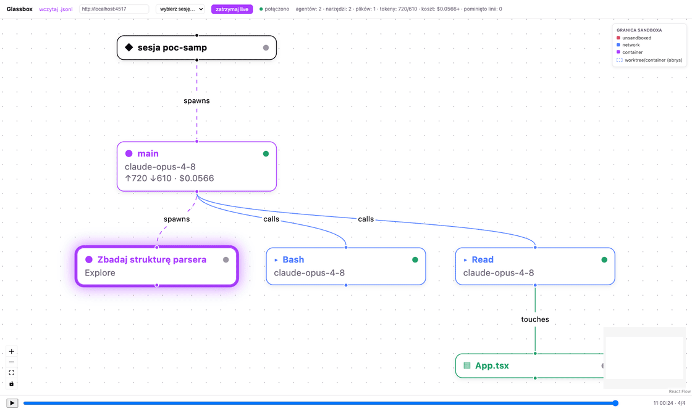
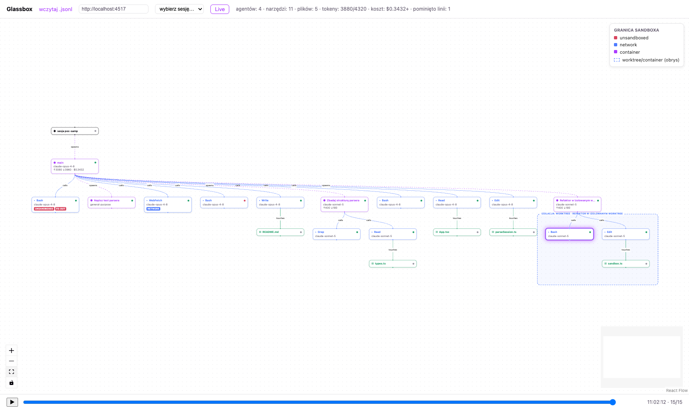

# Glassbox

Wizualizator wykonania sesji Claude Code jako grafu DAG. Wczytuje transkrypt
`.jsonl` (dokładnie taki, jaki Claude Code zapisuje w `~/.claude/projects/`) i
rysuje graf: sesja → agenci (main + subagenci) → wywołania narzędzi → pliki,
z tokenami, modelem i statusem (ok/error) na każdym węźle.



*Tryb live na przykładzie syntetycznym: nowe zdarzenia dolatują przez SSE,
graf dokłada węzły, scrubber podąża za końcem osi czasu.*

## Uruchomienie

```bash
npm install
npm run dev       # http://localhost:5173, przeciągnij .jsonl albo użyj przycisku
npm run build      # tsc --noEmit + build produkcyjny
npm test           # vitest — parser na przykładzie syntetycznym + na realnym transkrypcie
```

Wbudowany przykład (`public/sample.jsonl`) jest **syntetyczny** — mała sesja z
main agentem, dwoma subagentami, kilkoma wywołaniami narzędzi i plikami.
Realne transkrypty (dane prywatne) nigdy nie trafiają do repozytorium.

## Architektura

Parser (`src/parser/`) jest czystym modułem TS bez zależności od UI: bierze
string JSONL i zwraca `SessionGraph { nodes, edges, meta }` — węzły typu
`session`/`agent`/`tool_call`/`file`, krawędzie `spawns`/`calls`/`touches`.
Jest odporny na linie nieparsowalne lub o nieznanym typie — pomija je zamiast
się wywalać. Subagentów rozpoznaje na dwa sposoby zaobserwowane empirycznie w
realnych transkryptach: inline `isSidechain: true` między wywołaniem
Task/Agent a jego `tool_result`, oraz asynchroniczny spawn (sam node
powstaje z opisu wywołania, bez zagnieżdżonych dzieci — pełny transkrypt
subagenta w tym trybie żyje poza jednym plikiem `.jsonl`). Warstwa
prezentacji (Vite + React 18 + `@xyflow/react`) układa graf przez `elkjs`
(algorytm warstwowy, kierunek DOWN) i renderuje własne karty węzłów
(`AgentNode`, `ToolCallNode`, `FileNode`) z panelem szczegółów po kliknięciu.

## Replay, oś czasu i koszty

Pasek na dole (`Scrubber`) pozwala odtwarzać sesję event-po-evencie: suwak,
play/pauza (spacja) i strzałki do kroku. Layout jest liczony raz przy
wczytaniu — scrubber tylko zmienia widoczność węzłów/krawędzi (wygaszenie do
opacity 0.12 dla zdarzeń „z przyszłości"), graf „buduje się" chronologicznie
bez ponownego przeliczania elk. Węzeł najbliższy bieżącej pozycji dostaje
podświetlenie, a panel szczegółów podąża za nim podczas odtwarzania.

Koszty liczone są ze statycznej mapy cen (`src/pricing.ts`, USD/1M tokenów,
do ręcznej aktualizacji) — agregacja per agent (main i każdy subagent osobno)
widoczna na kartach węzłów i jako suma w nagłówku; nieznany model daje `null`
(pokazywane są wtedy same tokeny, a suma sesji oznaczona jest `+` jako
częściowa).

## Tryb live

Graf da się oglądać na żywo, w trakcie trwania sesji Claude Code — bez czekania
na jej koniec i bez ręcznego wczytywania pliku po każdej zmianie.

### Uruchomienie

```bash
node server/live.mjs ~/.claude/projects/<projekt>/<sesja>.jsonl
```

### Katalog sesji

Bez argumentu CLI serwer startuje w trybie **katalogu sesji** zamiast
pojedynczego pliku — domyślne użycie:

```bash
node server/live.mjs                              # katalog domyślny: ~/.claude/projects
GLASSBOX_SESSIONS_DIR=/inna/sciezka node server/live.mjs
```

W tym trybie:

- `GET /sessions` — lista wszystkich `*.jsonl` w katalogu (rekurencyjnie),
  posortowana po `mtime` malejąco, pliki 0 B pominięte, limit 500 wpisów.
- `GET /events?session=<ścieżka-względna>` — SSE dla wskazanego pliku, jak w
  trybie pojedynczego pliku. Ścieżka jest walidowana (`server/sessionPath.mjs`,
  przetestowane w `vitest`): `..`, ścieżki absolutne i symlinki wyprowadzające
  poza katalog sesji dostają `HTTP 400`.
- `GET /healthz` — `200 {"ok":true}`, używane też przez `HEALTHCHECK` obrazu Docker.

W UI (nagłówek): pole adresu serwera i lista rozwijana sesji (mtime + rozmiar).
Wybór sesji łączy się przez SSE tak samo jak przycisk „Live”. Adres serwera i
ostatnio wybrana sesja są trzymane w `localStorage` — przy starcie UI oferuje
wznowienie ostatniej sesji jednym kliknięciem.

Argument CLI ze ścieżką pliku (jak wyżej) nadal działa i ma pierwszeństwo —
przełącza serwer z powrotem w tryb pojedynczego pliku (`/sessions` niedostępne).

Serwer (Node ≥18, zero zależności runtime — tylko `node:http`/`node:fs`) staje
na stałym porcie `4517` i śledzi przyrost wskazanego pliku: `fs.watch` plus
fallback pollingiem co 1s (na wypadek systemów plików, gdzie `fs.watch`
milczy), czytając tylko nowe bajty od ostatniego offsetu — nigdy całego pliku
od zera. Niedokończona ostatnia linia jest buforowana do najbliższego
znaku nowej linii (`server/lineSplitter.mjs`, przetestowany w `vitest`).

Endpoint `GET http://localhost:4517/events` to SSE: najpierw cały dotychczasowy
backlog (jeden event `backlog` z tablicą linii), potem bieżące nowe linie
(event `line` na każdą), plus heartbeat co 15s.

W UI: przycisk **„Live”** obok „wczytaj .jsonl” łączy się z tym adresem
(`EventSource`, auto-reconnect wbudowany w przeglądarkę), pokazuje status
połączenia (zielona kropka „połączono” / „rozłączono”), akumuluje przychodzące
linie i re-parsuje je (debounce 500 ms) — nowe węzły przeliczają layout `elk`
tak samo jak przy zwykłym wczytaniu pliku. Scrubber w trybie live jest domyślnie
przypięty do końca osi czasu („follow”); ręczne przesunięcie suwaka (albo
strzałki/play) wyłącza follow do końca sesji live.

### Opcjonalny forwarder hooków

`hooks/glassbox-hook.sh` to skrypt, który możesz **ręcznie** podpiąć pod
`PostToolUse` we własnym `~/.claude/settings.json` — Glassbox nigdy sam niczego
tam nie zapisuje. Live mode działa bez niego (fs.watch + polling wystarczają);
hook tylko skraca opóźnienie do ~0, każąc serwerowi sprawdzić przyrost
natychmiast po każdym wywołaniu narzędzia zamiast czekać do najbliższego ticka
pollingu:

```json
"hooks": {
  "PostToolUse": [
    { "hooks": [{ "type": "command", "command": "/pelna/sciezka/do/glassbox/hooks/glassbox-hook.sh" }] }
  ]
}
```

Skrypt jest fire-and-forget (`curl` z timeoutem 1s, zawsze `exit 0`) — nigdy
nie blokuje ani nie przerywa wykonania Claude Code, nawet gdy serwer live nie
działa.

## Serwer MCP (analiza sesji z Claude Code)

Serwer live wystawia endpoint `POST /mcp` (JSON-RPC 2.0, transport Streamable
HTTP, zero SDK — `server/mcp.mjs`). Rejestracja w Claude Code:

```
claude mcp add --transport http glassbox http://127.0.0.1:4517/mcp
```

Cztery narzędzia:

| Narzędzie | Działanie |
|---|---|
| `list_sessions` | lista ostatnich sesji (ścieżka, rozmiar, mtime, liczba węzłów) |
| `get_session_graph` | graf sesji w kompaktowym TSV (zmierzone 2–10,5 tys. tokenów zależnie od liczby subagentów; id sekwencyjne `n0…nN`) |
| `get_node_detail` | pełny `detail`/`output`/`toolUseResult` + sąsiedztwo jednego węzła (~1200 tokenów) |
| `highlight_nodes` | podświetla wskazane węzły w otwartym UI (broadcast SSE, obrys teal + adnotacja w nagłówku) |

Endpoint jest wiązany z pętlą zwrotną (`127.0.0.1`, patrz `GLASSBOX_HOST`) —
nie jest widoczny z sieci lokalnej. Parametr `session` przechodzi przez tę samą
walidację `resolveSessionPath` co `/events` (odmowa path traversal). Adnotacje
z analizy trafiają do `data/annotations/` (gitignore — dane prywatne), a lekcje
uogólnione do korpusu `~/.claude/kb/lessons/` zapisuje asystent w Claude Code.

## Warstwa izolacji

Każdy węzeł grafu niesie `sandbox: SandboxInfo` (`src/parser/sandbox.ts`) —
typ izolacji i przekroczenia granicy, wyznaczone z markerów w `tool_use.input`
zaobserwowanych empirycznie na realnych transkryptach (nigdy przez zgadywanie —
brak sygnału daje `isolation: null`). Subagenci z izolacją `worktree`/`container`
dostają obrys grupy (React Flow group node, `parentId`+`extent`) obejmujący ich
własne tool_calle i pliki; pojedyncze wywołania mają badge (`unsandboxed` — czerwony,
`network`/`container`/`filesystem-out` — inne kolory), legenda w rogu kanwy, a
panel szczegółów dostał sekcję „Izolacja”.

| Marker | Źródło | Klasyfikacja |
|---|---|---|
| `Bash.input.dangerouslyDisableSandbox === true` | schemat Bash | `isolation: unsandboxed` + `filesystem-out` |
| `Bash.input.command` zawiera `curl`/`wget` | transkrypt bieżącej sesji (curl→npmjs) | `network` |
| `Bash.input.command` zawiera `docker`/`orb`/`orbctl` | specyfikacja zadania (brak w zbadanych transkryptach) | `container` |
| `WebFetch`/`WebSearch`/`mcp__*` (w tym tavily) | transkrypt bieżącej sesji (2× WebFetch) | `network` |
| `Agent.input.isolation === "worktree"` | schemat narzędzia Agent (brak w zbadanych transkryptach) | `isolation: worktree` |
| `Agent.input.isolation === "remote"` | schemat narzędzia Agent | `isolation: container` (mapowanie, uproszczenie) |

Pełna metodologia i cytaty ze zbadanych transkryptów — komentarz na górze
`src/parser/sandbox.ts`.

## Uruchomienie w OrbStack

Obraz produkcyjny (`Dockerfile`, multi-stage: build na `node:22-alpine` z
`npm run build`, runtime z samym `server/` + `dist/`, użytkownik non-root,
`HEALTHCHECK` na `/healthz`) serwuje statyczny build i backend live z jednego
kontenera — bez `npm run dev`.

```bash
docker compose up -d --build
```

`compose.yaml` mapuje port `4517:4517`, montuje `${HOME}/.claude/projects` w
kontenerze pod `/sessions` (`:ro`) i ustawia `GLASSBOX_SESSIONS_DIR=/sessions`
— serwer w kontenerze startuje więc od razu w trybie katalogu sesji. Po
starcie: `http://localhost:4517`.

```bash
curl localhost:4517/healthz     # {"ok":true}
curl localhost:4517/sessions    # lista sesji z hosta, tylko do odczytu
```



Uwaga: adresy `*.orb.local` OrbStacka nie rozwiązują się z poziomu sandboxa
narzędzi (Bash tool) — weryfikuj kontener wyłącznie przez `localhost`.
